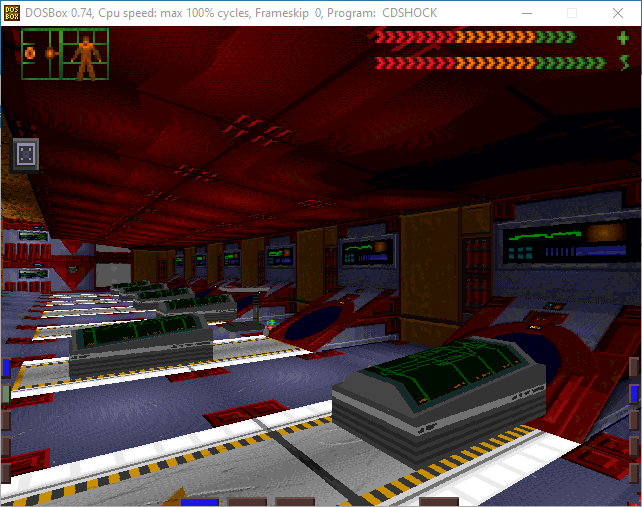
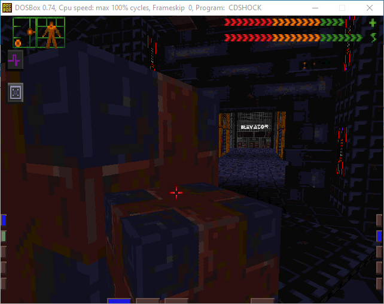
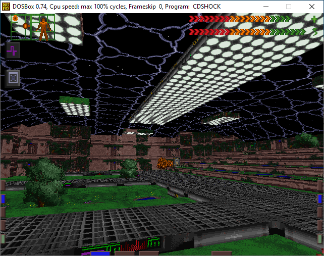
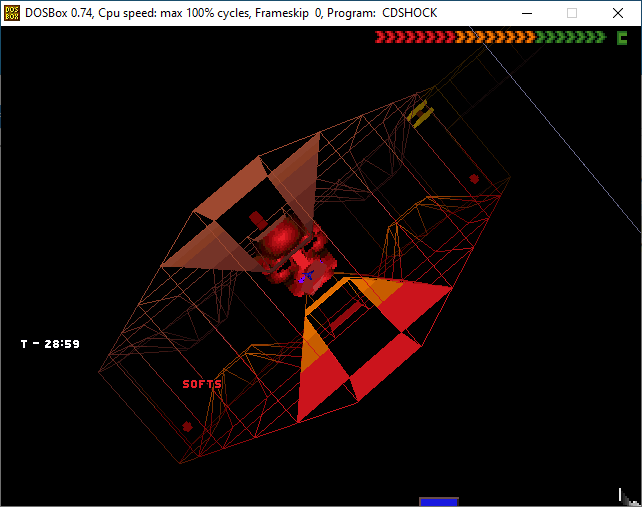
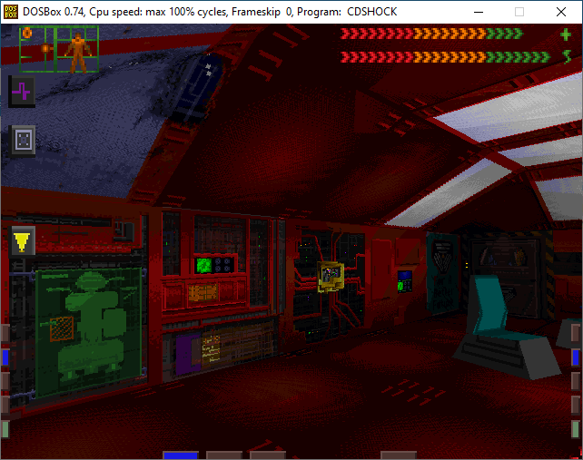

# Derelict
A System Shock mission created by Janne Ramstedt

Latest version can be found at the [GitHub repository releases](https://github.com/jramstedt/SS1Derelict/releases)

## Installation
Release package contains two directories:

### SS1
These files are for original ***cd-rom*** release and can be used with [Shockolate](https://github.com/Interrupt/systemshock) or [SSP](https://www.systemshock.org/index.php?topic=211).

Backup your install and copy included files (override) to System Shock's ```res\data\``` directory.

### SS1EE
These files are for the later Nightdive Studios' ***System Shock: Enhanced Edition*** release

Buy it on [Steam](https://store.steampowered.com/app/410710/System_Shock_Enhanced_Edition/) or [GOG](https://www.gog.com/en/game/system_shock_enhanced_edition)

Copy files to ```%APPDATA%\Nightdive Studios\System Shock EE\missions\derelict\``` directory.

Mission should show up in ***modifications*** screen.

## Tips
You can use map markers (open full map from the FULL text in small MFD view) to take notes, write codes down, name areas and mark places you need to go. There are no quest lists or pointers in System Shock.

## Screenshots






## Thank you
Christian Haas for [InkyBlackness HackEd](https://github.com/inkyblackness/hacked)  
LookingGlass Technologies  
Night Dive Studios for [source code](https://github.com/NightDive-Studio/shockmac)  
Makers of [SYSTEMSHOCK-Portable](https://www.systemshock.org/index.php?topic=211.0)  

## License

All original game data is owned by its copyright holders.

[CC BY-NC-SA 4.0](https://creativecommons.org/licenses/by-nc-sa/4.0/)

